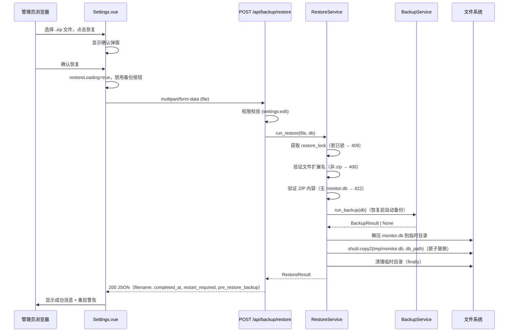
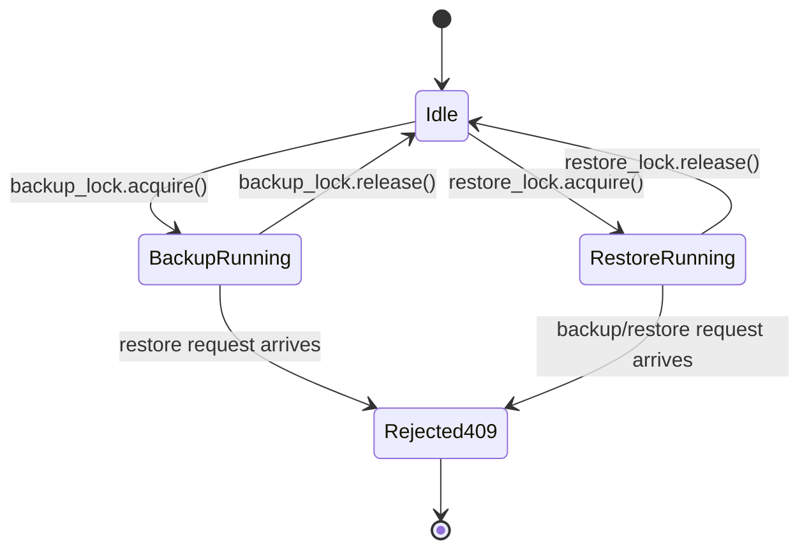

# Design Document: backup-restore

## Overview

本功能为 tiktok-monitor 系统新增备份恢复能力，是现有备份导出功能的对应入口。管理员可通过设置页面上传由系统生成的 `.zip` 备份文件，系统验证文件内容后自动备份当前数据库，再将备份文件中的 `monitor.db` 原子替换到当前数据库路径，实现全量恢复。

### 设计目标

- **安全性**：恢复前自动备份当前数据库，防止误操作导致数据丢失
- **原子性**：使用 copy-then-replace 策略，避免数据库处于中间状态
- **并发保护**：restore_lock 与 backup_lock 互斥，防止并发操作破坏数据完整性
- **可观测性**：完整的日志记录，响应中包含操作结果和重启提示
- **用户体验**：前端提供确认弹窗、loading 状态、结果展示和重启警告

---

## Architecture



### 并发控制架构



---

## Components and Interfaces

### 后端组件

#### 1. `RestoreService`（新增，位于 `backup_service.py`）

```python
@dataclass
class RestoreResult:
    filename: str                          # 恢复来源文件名
    completed_at: datetime                 # 恢复完成时间
    restart_required: bool                 # 始终为 True
    pre_restore_backup: Optional[BackupResult]  # 恢复前自动备份结果，失败时为 None

class RestoreService:
    _lock: asyncio.Lock                    # restore_lock，独立于 BackupService._lock

    def is_running(self) -> bool: ...

    async def run_restore(
        self,
        file_content: bytes,
        original_filename: str,
        db: Session,
    ) -> RestoreResult: ...
```

**run_restore() 流程：**

1. 尝试获取 `restore_lock`；若已锁定则抛出 `RestoreInProgressError`
2. 验证 `original_filename` 以 `.zip` 结尾；否则抛出 `InvalidFileTypeError`
3. 尝试将 `file_content` 解析为 ZIP；若失败抛出 `InvalidZipError`
4. 检查 ZIP 内是否包含 `monitor.db`；否则抛出 `MissingDatabaseError`
5. 调用 `backup_service.run_backup(db)` 进行恢复前备份（失败时记录 warning，继续执行）
6. 创建临时目录，解压 `monitor.db` 到临时目录
7. 使用 `shutil.copy2` 将临时文件复制到 `db_path`（原子替换）
8. 记录完成日志
9. `finally`：清理临时目录
10. 返回 `RestoreResult`

#### 2. `POST /api/backup/restore`（新增，位于 `backup.py`）

```python
@router.post("/restore", response_model=RestoreResponse)
async def restore_backup(
    file: UploadFile = File(...),
    db: Session = Depends(get_db),
    _=Depends(require_permission("settings:edit")),
) -> RestoreResponse: ...
```

**错误映射：**

| 异常 | HTTP 状态码 | 说明 |
|------|------------|------|
| `RestoreInProgressError` | 409 | 恢复正在进行中 |
| `BackupInProgressError` | 409 | 备份正在进行中，拒绝恢复 |
| `InvalidFileTypeError` | 400 | 文件扩展名不是 .zip |
| `InvalidZipError` | 422 | 文件不是有效的 ZIP 格式 |
| `MissingDatabaseError` | 422 | ZIP 中不包含 monitor.db |
| `RestoreIOError` | 500 | 文件替换失败 |

#### 3. `BackupService.is_running()` 互斥检查

在 `RestoreService.run_restore()` 获取 restore_lock 后，还需检查 `backup_service.is_running()`；若备份正在进行，则抛出 `BackupInProgressError`（409）。

同样，`POST /api/backup/trigger` 在执行前需检查 `restore_service.is_running()`；若恢复正在进行，则返回 409。

### 前端组件

#### 1. `frontend/src/api/backup.js`（扩展）

```javascript
// 新增函数
export function restoreBackup(file) {
  const formData = new FormData()
  formData.append('file', file)
  return request({
    url: '/backup/restore',
    method: 'post',
    data: formData,
    headers: { 'Content-Type': 'multipart/form-data' },
    timeout: 60000  // 恢复操作可能耗时较长
  })
}
```

#### 2. `frontend/src/views/Settings.vue`（扩展）

在"数据备份"区块的"立即备份"表单项之后，新增"备份恢复"子区块：

**新增模板元素：**
- `el-divider`：标题"备份恢复"
- `el-upload`：`accept=".zip"`，`auto-upload=false`，`limit=1`，显示已选文件名
- 恢复按钮：`:loading="restoreLoading"`，`:disabled="restoreLoading || backupLoading"`
- 确认弹窗：`ElMessageBox.confirm`，警告文案说明操作不可撤销
- 成功提示：显示恢复文件名 + 重启警告（`el-alert type="warning"`）
- 错误提示：显示 API 返回的 error detail

**新增响应式状态：**
```javascript
const restoreFile = ref(null)          // 已选择的文件对象
const restoreLoading = ref(false)      // 恢复进行中
const restoreResult = ref(null)        // 成功结果
const restoreError = ref(null)         // 错误信息
```

**"立即备份"按钮禁用条件扩展：**
```javascript
:disabled="!form.backup_enabled || restoreLoading"
```

---

## Data Models

### 后端 Pydantic Schema

```python
class PreRestoreBackupInfo(BaseModel):
    filename: str
    file_size: int  # bytes

class RestoreResponse(BaseModel):
    filename: str                                    # 恢复来源 ZIP 文件名
    completed_at: datetime                           # 恢复完成时间（UTC）
    restart_required: bool                           # 始终为 True
    pre_restore_backup: Optional[PreRestoreBackupInfo]  # 恢复前备份信息，失败时为 null
```

**响应示例（成功）：**
```json
{
  "filename": "monitor_backup_20260601_120000.zip",
  "completed_at": "2026-06-01T12:05:30.123456",
  "restart_required": true,
  "pre_restore_backup": {
    "filename": "monitor_backup_20260601_120500.zip",
    "file_size": 204800
  }
}
```

**响应示例（恢复前备份失败）：**
```json
{
  "filename": "monitor_backup_20260601_120000.zip",
  "completed_at": "2026-06-01T12:05:30.123456",
  "restart_required": true,
  "pre_restore_backup": null
}
```

### 自定义异常类

```python
class RestoreInProgressError(Exception): pass
class BackupInProgressError(Exception): pass
class InvalidFileTypeError(Exception): pass
class InvalidZipError(Exception): pass
class MissingDatabaseError(Exception): pass
class RestoreIOError(Exception): pass
```

### 临时目录命名规范

```
/tmp/tiktok_monitor_restore_{uuid4().hex}/
└── monitor.db   # 从 ZIP 解压的数据库文件
```

---

## Correctness Properties

*A property is a characteristic or behavior that should hold true across all valid executions of a system — essentially, a formal statement about what the system should do. Properties serve as the bridge between human-readable specifications and machine-verifiable correctness guarantees.*

### Property 1: 非 ZIP 扩展名文件始终被拒绝

*For any* 文件名，若其扩展名不是 `.zip`（大小写不敏感），则 `run_restore()` 应抛出 `InvalidFileTypeError`，且不应修改数据库文件。

**Validates: Requirements 1.3**

---

### Property 2: 不含 monitor.db 的 ZIP 始终被拒绝

*For any* 有效的 ZIP 归档文件，若其内部不包含名为 `monitor.db` 的文件，则 `run_restore()` 应抛出 `MissingDatabaseError`，且不应修改数据库文件。

**Validates: Requirements 1.4**

---

### Property 3: 无效 ZIP 字节流始终被拒绝

*For any* 不能被解析为有效 ZIP 格式的字节序列，`run_restore()` 应抛出 `InvalidZipError`，且不应修改数据库文件。

**Validates: Requirements 1.5**

---

### Property 4: 恢复操作完整替换数据库内容

*For any* 包含 `monitor.db` 的有效 ZIP 归档，执行 `run_restore()` 后，数据库路径处的文件内容应与 ZIP 中提取的 `monitor.db` 内容完全一致（字节级相等）。

**Validates: Requirements 3.2, 3.3**

---

### Property 5: 成功响应始终包含必要字段

*For any* 有效的备份 ZIP 文件，`run_restore()` 成功后返回的 `RestoreResult` 应始终包含非空的 `filename`、`completed_at`、`restart_required=True` 以及 `pre_restore_backup` 字段（值为 `BackupResult` 或 `None`）。

**Validates: Requirements 6.1, 2.3**

---

### Property 6: 恢复操作后临时文件不残留

*For any* 恢复操作（无论成功或失败），操作完成后，在 `/tmp` 下以 `tiktok_monitor_restore_` 为前缀的临时目录应不存在。

**Validates: Requirements 5.1, 5.2**

---

### Property 7: 恢复进行中时备份请求被拒绝

*For any* 正在进行的恢复操作，同时发起的备份触发请求应返回 HTTP 409，且不应启动新的备份操作。

**Validates: Requirements 4.3**

---

### Property 8: 前端成功消息包含文件名和重启警告

*For any* 包含 `filename` 字段的成功响应，Settings.vue 渲染的成功提示文本应包含该 `filename` 值，且应包含重启相关的警告文案。

**Validates: Requirements 7.4, 6.2**

---

### Property 9: 前端错误消息透传 API 错误详情

*For any* 包含 `detail` 字段的 API 错误响应，Settings.vue 渲染的错误提示文本应与 `detail` 字段内容完全一致。

**Validates: Requirements 7.5**

---

## Error Handling

### 后端错误处理策略

| 场景 | 处理方式 | HTTP 状态码 |
|------|---------|------------|
| 并发恢复请求 | 立即返回，不等待锁 | 409 |
| 备份进行中收到恢复请求 | 立即返回 | 409 |
| 恢复进行中收到备份请求 | 立即返回 | 409 |
| 文件扩展名非 .zip | 返回描述性错误 | 400 |
| ZIP 格式无效 | 返回描述性错误 | 422 |
| ZIP 中无 monitor.db | 返回描述性错误 | 422 |
| 恢复前备份失败 | 记录 WARNING，继续执行 | — |
| 文件替换失败（权限/磁盘满） | 记录 ERROR，返回错误 | 500 |
| 临时目录清理失败 | 记录 WARNING，不影响响应 | — |

### 数据库安全保障

- 使用 `shutil.copy2(src, dst)` 进行文件替换，该操作在同一文件系统上接近原子性
- 若 `copy2` 失败，原始数据库文件保持不变（copy2 失败不会删除目标文件）
- 临时文件始终在 `finally` 块中清理，确保不残留

### 前端错误处理策略

- API 调用失败时，从 `error.response?.data?.detail` 提取错误信息
- 若无 detail 字段，显示通用错误提示
- 恢复完成后（成功或失败）重置 `restoreLoading` 状态
- 成功后清空已选文件，防止重复提交

---

## Testing Strategy

### 单元测试（pytest）

**`tests/test_restore_service.py`**

针对 `RestoreService` 的纯逻辑测试，使用 `tmp_path` fixture 模拟文件系统：

- 验证非 .zip 扩展名被拒绝（对应 Property 1）
- 验证不含 monitor.db 的 ZIP 被拒绝（对应 Property 2）
- 验证无效字节流被拒绝（对应 Property 3）
- 验证恢复前备份失败时操作继续（对应 Requirement 2.2）
- 验证文件替换失败时返回 RestoreIOError（对应 Requirement 3.4）

**`tests/test_backup_api.py`（扩展）**

- 验证无权限请求返回 403
- 验证并发恢复请求返回 409
- 验证恢复进行中时备份请求返回 409

### 属性测试（pytest + hypothesis）

使用 [Hypothesis](https://hypothesis.readthedocs.io/) 库，每个属性测试最少运行 100 次迭代。

```python
# 标注格式示例
# Feature: backup-restore, Property 1: 非 ZIP 扩展名文件始终被拒绝
@given(filename=st.text(min_size=1).filter(lambda s: not s.lower().endswith('.zip')))
@settings(max_examples=100)
def test_property_1_non_zip_rejected(filename): ...

# Feature: backup-restore, Property 2: 不含 monitor.db 的 ZIP 始终被拒绝
@given(filenames=st.lists(
    st.text(min_size=1).filter(lambda s: s != 'monitor.db'),
    min_size=0, max_size=5
))
@settings(max_examples=100)
def test_property_2_zip_without_monitor_db_rejected(filenames): ...

# Feature: backup-restore, Property 3: 无效 ZIP 字节流始终被拒绝
@given(data=st.binary(min_size=0, max_size=1024).filter(lambda b: not _is_valid_zip(b)))
@settings(max_examples=100)
def test_property_3_invalid_zip_rejected(data): ...

# Feature: backup-restore, Property 4: 恢复操作完整替换数据库内容
@given(db_content=st.binary(min_size=1, max_size=4096))
@settings(max_examples=100)
def test_property_4_restore_replaces_db_content(db_content, tmp_path): ...

# Feature: backup-restore, Property 5: 成功响应始终包含必要字段
@given(db_content=st.binary(min_size=1, max_size=1024))
@settings(max_examples=100)
def test_property_5_success_response_has_required_fields(db_content): ...

# Feature: backup-restore, Property 6: 恢复操作后临时文件不残留
@given(db_content=st.binary(min_size=1, max_size=1024))
@settings(max_examples=100)
def test_property_6_no_temp_files_after_restore(db_content, tmp_path): ...
```

### 集成测试

- 使用 FastAPI `TestClient` 测试完整的 HTTP 请求/响应流程
- 验证权限控制（403）
- 验证并发锁（409）
- 验证成功恢复的完整响应结构

### 前端测试（Vitest + Vue Test Utils）

- 验证"备份恢复"区块渲染（对应 Requirement 7.1）
- 验证确认弹窗触发（对应 Requirement 7.2）
- 验证 loading 状态和按钮禁用（对应 Requirement 7.3）
- 属性测试 Property 8：对任意 filename 字符串，成功消息包含该字符串
- 属性测试 Property 9：对任意 detail 字符串，错误消息与之完全一致
