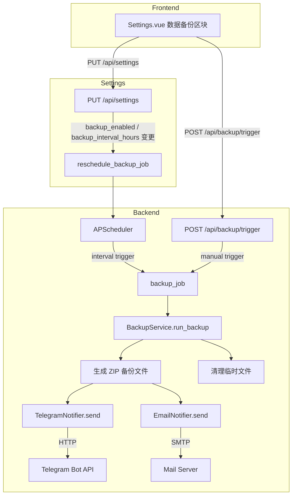

# Design Document: Data Backup & Notification

## Overview

本功能为 tiktok-monitor 系统新增数据库自动备份与通知能力。系统将周期性地将 SQLite 数据库文件压缩打包，并通过 Telegram Bot 和/或 SMTP 邮件将备份文件发送给管理员。管理员可在系统设置页面配置所有备份参数，并可随时手动触发一次备份。

### 设计目标

- 最小化对现有代码的侵入：复用已有的 `APScheduler`、`MonitorSettings` 模型和 `settings` API
- 备份流程与通知流程解耦：备份文件生成成功后，通知失败不影响备份结果
- 敏感字段（Bot Token、SMTP 密码）在 API 响应中脱敏，不以明文返回

---

## Architecture



### 关键设计决策

1. **备份锁（in-progress flag）**：使用模块级 `asyncio.Lock` 防止并发备份，手动触发时若锁被占用则返回 HTTP 409。
2. **通知失败不阻断备份**：`TelegramNotifier` 和 `EmailNotifier` 内部捕获所有异常，仅记录日志，不向上抛出。
3. **敏感字段脱敏**：`SettingsResponse` 中 `telegram_bot_token` 和 `smtp_password` 返回 `"********"`（已设置）或 `""`（未设置），实际值仅存储在数据库中。
4. **调度器复用**：直接使用 `backend/app/core/scheduler.py` 中的全局 `scheduler` 实例，与监控任务共存。

---

## Components and Interfaces

### 1. BackupService (`backend/app/services/backup_service.py`)

核心备份逻辑，负责文件复制、压缩、通知分发和临时文件清理。

```python
class BackupService:
    _lock: asyncio.Lock  # 防止并发备份

    async def run_backup(self, db: Session) -> BackupResult:
        """
        执行完整备份流程：
        1. 获取 MonitorSettings
        2. 复制 DB 文件到临时目录
        3. 压缩为 ZIP（命名格式：monitor_backup_YYYYMMDD_HHMMSS.zip）
        4. 调用 TelegramNotifier（如已启用）
        5. 调用 EmailNotifier（如已启用）
        6. 清理临时文件
        7. 返回 BackupResult
        """

    def is_running(self) -> bool:
        """返回当前是否有备份正在进行。"""

    def generate_backup_filename(self, dt: datetime) -> str:
        """根据给定时间生成备份文件名。"""
```

**BackupResult 数据结构：**

```python
@dataclass
class BackupResult:
    filename: str          # e.g. "monitor_backup_20260601_120000.zip"
    file_size: int         # bytes
    completed_at: datetime
```

### 2. TelegramNotifier (`backend/app/services/backup_service.py` 内部类或独立函数)

```python
async def send_telegram(
    bot_token: str,
    chat_id: str,
    file_path: Path,
    caption: str,
    timeout: int = 60,
) -> None:
    """
    通过 Telegram Bot API sendDocument 接口发送文件。
    - 超时 60 秒
    - 非 2xx 响应记录错误日志，不重试，不抛出异常
    - bot_token 或 chat_id 为空时跳过并记录 warning
    """
```

### 3. EmailNotifier (`backend/app/services/backup_service.py` 内部类或独立函数)

```python
async def send_email(
    smtp_host: str,
    smtp_port: int,
    smtp_username: str,
    smtp_password: str,
    smtp_sender: str,
    email_recipient: str,
    smtp_use_tls: bool,
    file_path: Path,
    subject: str,
) -> None:
    """
    通过 SMTP 发送带附件的邮件。
    - smtp_use_tls=True 时使用 STARTTLS
    - SMTP 错误记录日志，不抛出异常
    - smtp_host 或 email_recipient 为空时跳过并记录 warning
    """
```

### 4. Backup API (`backend/app/api/backup.py`)

```python
router = APIRouter(prefix="/backup", tags=["Backup"])

@router.post("/trigger", response_model=BackupTriggerResponse)
async def trigger_backup(
    db: Session = Depends(get_db),
    _=Depends(require_permission("settings:edit"))
):
    """
    手动触发备份。
    - 需要 settings:edit 权限
    - 若备份正在进行，返回 HTTP 409
    - 成功返回 filename、file_size、completed_at
    """
```

**BackupTriggerResponse schema：**

```python
class BackupTriggerResponse(BaseModel):
    filename: str
    file_size: int        # bytes
    completed_at: datetime
```

### 5. 调度器集成 (`backend/app/services/backup_service.py`)

```python
def register_backup_job(scheduler, db_factory) -> None:
    """
    从 MonitorSettings 读取 backup_enabled 和 backup_interval_hours，
    注册或移除 APScheduler job（id="scheduled_backup"）。
    """

def reschedule_backup_job(scheduler, db_factory) -> None:
    """
    在设置更新后调用，重新注册备份任务（或移除，若 backup_enabled=False）。
    """
```

### 6. Settings 扩展

**`backend/app/api/settings.py`** 的 `update_settings` 端点在检测到 `backup_enabled` 或 `backup_interval_hours` 变更时，调用 `reschedule_backup_job`。

---

## Data Models

### MonitorSettings 新增字段（Alembic migration）

| 字段名 | 类型 | 默认值 | 说明 |
|---|---|---|---|
| `backup_enabled` | Boolean | False | 是否启用自动备份 |
| `backup_interval_hours` | Integer | 24 | 备份间隔（小时，1–168） |
| `telegram_enabled` | Boolean | False | 是否启用 Telegram 通知 |
| `telegram_bot_token` | String(512) | "" | Telegram Bot Token（存储明文，响应脱敏） |
| `telegram_chat_id` | String(128) | "" | Telegram Chat ID |
| `email_enabled` | Boolean | False | 是否启用邮件通知 |
| `smtp_host` | String(255) | "" | SMTP 服务器地址 |
| `smtp_port` | Integer | 587 | SMTP 端口 |
| `smtp_username` | String(255) | "" | SMTP 用户名 |
| `smtp_password` | String(512) | "" | SMTP 密码（存储明文，响应脱敏） |
| `smtp_sender` | String(255) | "" | 发件人地址 |
| `email_recipient` | String(255) | "" | 收件人地址 |
| `smtp_use_tls` | Boolean | True | 是否使用 STARTTLS |

### Pydantic Schemas 扩展

**`SettingsUpdate`** 新增所有上述字段（均为 `Optional`）。

**`SettingsResponse`** 新增所有上述字段，其中：
- `telegram_bot_token`：若数据库值非空则返回 `"********"`，否则返回 `""`
- `smtp_password`：同上

### 文件系统

备份文件在发送后立即删除，不持久化存储在服务器上。临时文件路径：

```
/tmp/tiktok_monitor_backup_{uuid}/
  monitor_backup_YYYYMMDD_HHMMSS.zip
```

---

## Correctness Properties

*A property is a characteristic or behavior that should hold true across all valid executions of a system—essentially, a formal statement about what the system should do. Properties serve as the bridge between human-readable specifications and machine-verifiable correctness guarantees.*

### Property 1: 备份文件名格式

*For any* datetime value, the generated backup filename SHALL match the pattern `monitor_backup_YYYYMMDD_HHMMSS.zip` where YYYYMMDD and HHMMSS are derived from that datetime.

**Validates: Requirements 1.2**

---

### Property 2: 备份完成后无临时文件残留

*For any* backup execution outcome (success or failure), after the backup workflow completes, no temporary files created during that backup SHALL remain in the filesystem.

**Validates: Requirements 1.5**

---

### Property 3: 备份间隔验证

*For any* integer value submitted as `backup_interval_hours`, if the value is outside the range [1, 168], the Settings API SHALL return HTTP 422; if the value is within [1, 168], the API SHALL accept it.

**Validates: Requirements 2.5, 6.3**

---

### Property 4: Telegram 通知 caption 包含必要信息

*For any* backup metadata (timestamp, file_size), the generated Telegram caption SHALL contain both a human-readable representation of the timestamp and a human-readable representation of the file size.

**Validates: Requirements 3.2**

---

### Property 5: 邮件通知失败不阻断备份流程

*For any* SMTP error condition (connection failure, authentication error, send error), the backup workflow SHALL still complete and return a valid `BackupResult` without propagating the email error.

**Validates: Requirements 4.4**

---

### Property 6: SMTP 配置完整传递

*For any* SMTP configuration stored in MonitorSettings, the Email_Notifier SHALL use exactly those configuration values (host, port, username, password, sender, recipient) when establishing the connection and sending the email.

**Validates: Requirements 4.2**

---

### Property 7: 手动触发响应包含完整字段

*For any* successful manual backup execution, the API response SHALL contain all three required fields: `filename` (string), `file_size` (integer, bytes), and `completed_at` (datetime).

**Validates: Requirements 5.4**

---

### Property 8: 设置响应包含所有备份配置字段

*For any* MonitorSettings record with backup fields set, the GET `/api/settings` response SHALL include all 13 backup configuration fields defined in Requirement 6.1.

**Validates: Requirements 6.2**

---

### Property 9: 敏感字段脱敏

*For any* MonitorSettings where `telegram_bot_token` or `smtp_password` is non-empty, the GET `/api/settings` response SHALL return `"********"` for those fields, never the actual stored value. When the field is empty, the response SHALL return `""`.

**Validates: Requirements 6.5**

---

### Property 10: 表单提交包含所有备份字段

*For any* combination of backup settings values entered in the Settings page, the submitted PUT request body SHALL include all backup configuration fields alongside the existing settings fields.

**Validates: Requirements 7.6**

---

## Error Handling

| 场景 | 处理方式 |
|---|---|
| DB 文件不存在或不可读 | 记录 ERROR 日志，中止备份，不抛出未处理异常 |
| ZIP 压缩失败 | 记录 ERROR 日志，清理临时文件，中止备份 |
| Telegram API 非 2xx 响应 | 记录 ERROR（含状态码和响应体），不重试，不阻断流程 |
| Telegram 请求超时（>60s） | 取消请求，记录 timeout ERROR，不阻断流程 |
| Bot Token / Chat ID 为空 | 记录 WARNING，跳过 Telegram 通知 |
| SMTP 连接/发送失败 | 记录 ERROR（含 SMTP host 和错误信息），不阻断流程 |
| SMTP 必填字段为空 | 记录 WARNING，跳过邮件通知 |
| 并发备份冲突 | 返回 HTTP 409，消息说明备份正在进行 |
| backup_interval_hours 超出范围 | 返回 HTTP 422，包含描述性错误信息 |

---

## Testing Strategy

### 单元测试（pytest）

针对纯函数和可 mock 的组件：

- `BackupService.generate_backup_filename`：验证文件名格式（对应 Property 1）
- `BackupService.run_backup`（mock 文件系统）：验证临时文件清理（对应 Property 2）
- `send_telegram`（mock httpx）：验证 caption 内容（对应 Property 4）、错误处理（Requirements 3.3, 3.4, 3.5）
- `send_email`（mock smtplib）：验证配置传递（对应 Property 6）、失败不阻断（对应 Property 5）、STARTTLS 调用（Requirement 4.3）
- Settings API（mock DB）：验证脱敏逻辑（对应 Property 9）、字段完整性（对应 Property 8）、区间验证（对应 Property 3）

### 属性测试（pytest + hypothesis）

使用 [Hypothesis](https://hypothesis.readthedocs.io/) 库，每个属性测试最少运行 100 次迭代。

每个属性测试使用注释标注对应设计属性：
`# Feature: data-backup-notification, Property {N}: {property_text}`

- **Property 1**：`@given(st.datetimes())` → 验证文件名格式
- **Property 2**：`@given(st.booleans())` 模拟成功/失败 → 验证无临时文件残留
- **Property 3**：`@given(st.integers())` → 验证区间验证逻辑
- **Property 4**：`@given(st.datetimes(), st.integers(min_value=0))` → 验证 caption 包含时间戳和文件大小
- **Property 5**：`@given(st.sampled_from([...smtp_errors...]))` → 验证备份流程完成
- **Property 6**：`@given(smtp_config_strategy())` → 验证配置完整传递
- **Property 7**：`@given(backup_result_strategy())` → 验证响应字段完整性
- **Property 8**：`@given(settings_strategy())` → 验证响应字段完整性
- **Property 9**：`@given(st.text(min_size=1))` → 验证脱敏逻辑
- **Property 10**：`@given(backup_settings_strategy())` → 验证表单提交完整性

### 集成测试

- 完整备份流程端到端（使用真实临时 SQLite 文件，mock Telegram/SMTP）
- 调度器注册/注销（mock APScheduler）
- 设置更新触发重新调度

### 前端测试（Vitest + Vue Test Utils）

- Settings.vue 渲染备份区块（Example）
- `backup_enabled` 切换禁用其他字段（Example）
- `telegram_enabled` / `email_enabled` 切换（Example）
- "立即备份"按钮 loading 状态和结果提示（Example）
