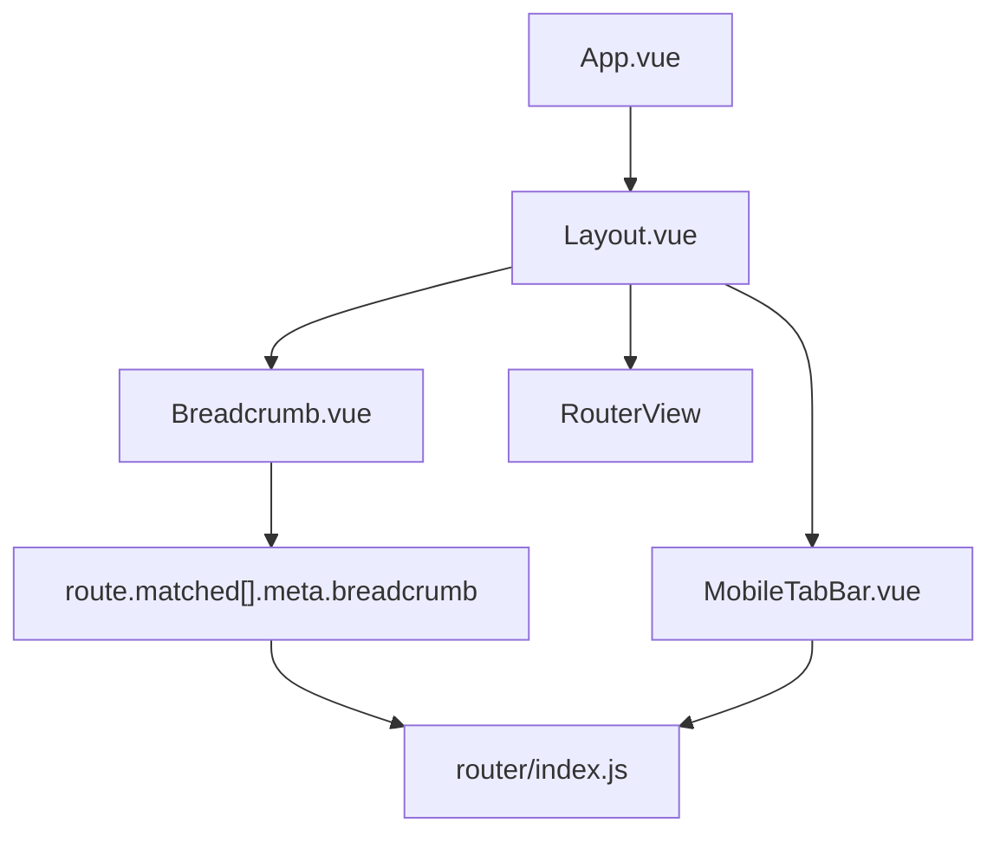

# 设计文档：移动端响应式 UI

## 概述

本功能为 TikTok Monitor 前端管理系统（Vue 3 + Element Plus + Vite）添加完整的响应式移动端支持，以及面包屑导航组件。

核心改造目标：
- **Layout.vue**：引入响应式断点逻辑，支持移动端 iOS 卡片风格底部 Tab Bar、平板折叠侧边栏、桌面端完整侧边栏三种模式
- **MobileTabBar.vue**：新增移动端专属底部 Tab Bar 组件，替代汉堡菜单方案
- **Breadcrumb.vue**：新增面包屑组件，基于 `route.matched` 自动生成层级导航
- **router/index.js**：为每条路由添加 `breadcrumb` meta 字段
- **全局 CSS**：iOS 卡片风格样式、表格转卡片列表、安全区域适配、对话框移动端全屏覆盖

断点定义：
| 模式 | 视口宽度 |
|------|---------|
| 移动端 | ≤ 768px |
| 平板端 | 769px – 1024px |
| 桌面端 | > 1024px |

### iOS 卡片风格设计语言（移动端专属）

移动端采用 iOS Human Interface Guidelines 风格，而非简单的响应式缩放，核心设计令牌如下：

| 设计令牌 | 值 | 用途 |
|---------|---|------|
| 系统背景色 | `#F2F2F7` | 页面背景、分组背景 |
| 卡片背景色 | `#FFFFFF` | 卡片、列表项背景 |
| 主色调 | `#007AFF` | 选中态、链接、主按钮 |
| 卡片圆角 | `12px – 16px` | 所有卡片容器 |
| 卡片阴影 | `0 2px 12px rgba(0,0,0,0.08)` | 卡片悬浮感 |
| 系统字体 | `-apple-system, BlinkMacSystemFont, 'SF Pro Text', sans-serif` | 全局字体栈 |
| 触摸区域 | `min-height: 44px` | 所有可点击元素 |
| 毛玻璃效果 | `backdrop-filter: blur(20px) saturate(180%)` | 顶部栏、底部 Tab Bar |
| 安全区域 | `env(safe-area-inset-*)` | 底部 Tab Bar、顶部栏 |

---

## 架构

### 响应式状态管理

使用 Vue 3 `useWindowSize` 或原生 `window.matchMedia` + `resize` 事件监听，在 `Layout.vue` 内部维护响应式状态，无需引入额外状态管理库。

```
Layout.vue
├── 响应式状态
│   ├── isMobile (≤768px)
│   ├── isTablet (769-1024px)
│   ├── sidebarOpen (移动端侧边栏是否展开，仅平板/桌面端使用)
│   └── sidebarCollapsed (平板端是否折叠)
├── [桌面端/平板端] Sidebar 区域
│   ├── 桌面端：固定 200px，完整菜单
│   └── 平板端：折叠 64px，仅图标 + tooltip
├── [移动端] MobileTabBar.vue（底部 Tab Bar，替代侧边栏）
├── Header 区域
│   ├── 桌面端/平板端：用户名 + 退出
│   └── 移动端：毛玻璃顶部栏 + 页面标题 + 退出图标
└── Main 区域
    ├── Breadcrumb.vue（桌面端/平板端显示）
    └── <router-view />（移动端内容以卡片风格渲染）
```

### 移动端架构变化（iOS 风格）

移动端不再使用汉堡菜单 + 侧边栏抽屉方案，改为 iOS 原生 App 风格的底部 Tab Bar 导航：

```
移动端布局
├── 毛玻璃顶部栏（fixed, z-index: 100）
│   ├── 页面标题（居中）
│   └── 退出按钮（右侧）
├── 主内容区（padding-top: 顶部栏高度 + safe-area-inset-top）
│   └── iOS 卡片列表（替代 el-table）
└── 底部 Tab Bar（fixed, z-index: 100）
    ├── 图标 + 文字标签
    ├── 毛玻璃背景
    └── padding-bottom: env(safe-area-inset-bottom)
```

### 组件关系



---

## 组件与接口

### Layout.vue 改造

**新增响应式逻辑（`<script setup>`）：**

```js
// 断点检测
const windowWidth = ref(window.innerWidth)
const isMobile = computed(() => windowWidth.value <= 768)
const isTablet = computed(() => windowWidth.value > 768 && windowWidth.value <= 1024)
const isDesktop = computed(() => windowWidth.value > 1024)

// 平板端折叠状态（由断点自动控制）
const sidebarCollapsed = computed(() => isTablet.value)

// 监听窗口变化
const handleResize = () => {
  windowWidth.value = window.innerWidth
}
onMounted(() => window.addEventListener('resize', handleResize))
onUnmounted(() => window.removeEventListener('resize', handleResize))
```

**模板结构变化：**

| 元素 | 变化 |
|------|------|
| `el-aside` | `v-if="!isMobile"`，动态 `width`（200px / 64px） |
| `el-menu` | 绑定 `:collapse="sidebarCollapsed"` |
| 汉堡按钮 | **移除**，移动端改用底部 Tab Bar |
| 遮罩层 | **移除**，移动端不再需要 |
| 顶部栏 | 移动端改为毛玻璃样式，显示页面标题 |
| `MobileTabBar` | `v-if="isMobile"` 插入布局底部 |
| 用户名 `span.username` | `v-show="!isMobile"` |

---

### MobileTabBar.vue（新增）

**文件路径：** `frontend/src/components/MobileTabBar.vue`

**功能：** 移动端专属底部 Tab Bar，替代侧边栏汉堡菜单方案，采用 iOS 风格固定底部导航。

**接口：** 无 props，基于 `useRoute()` 和 `useAuthStore()` 自动生成可见菜单项。

**Tab 项定义：**

```js
const tabs = computed(() => [
  {
    key: '/monitor',
    label: '监控',
    icon: Monitor,
    permission: 'monitor:view'
  },
  {
    key: '/op-accounts',
    label: '运营',
    icon: Briefcase,
    permission: 'op_account:view'
  },
  {
    key: '/team/member',
    label: '团队',
    icon: UserFilled,
    permission: 'team:member:view'
  },
  {
    key: '/settings',
    label: '设置',
    icon: Setting,
    permission: 'settings:view'
  }
].filter(tab => authStore.hasPermission(tab.permission)))

// 当前激活项
const activeTab = computed(() => {
  const path = route.path
  if (path.startsWith('/monitor') || path.startsWith('/accounts')) return '/monitor'
  if (path.startsWith('/op-accounts')) return '/op-accounts'
  if (path.startsWith('/team')) return '/team/member'
  if (path.startsWith('/settings')) return '/settings'
  return ''
})
```

**模板结构：**

```html
<div class="mobile-tab-bar">
  <div
    v-for="tab in tabs"
    :key="tab.key"
    class="tab-item"
    :class="{ 'is-active': activeTab === tab.key }"
    @click="router.push(tab.key)"
  >
    <el-icon class="tab-icon"><component :is="tab.icon" /></el-icon>
    <span class="tab-label">{{ tab.label }}</span>
  </div>
</div>
```

**样式规范（iOS 风格）：**

```css
.mobile-tab-bar {
  position: fixed;
  bottom: 0;
  left: 0;
  right: 0;
  height: calc(49px + env(safe-area-inset-bottom));
  padding-bottom: env(safe-area-inset-bottom);
  background: rgba(249, 249, 249, 0.94);
  backdrop-filter: blur(20px) saturate(180%);
  -webkit-backdrop-filter: blur(20px) saturate(180%);
  border-top: 0.5px solid rgba(0, 0, 0, 0.12);
  display: flex;
  align-items: flex-start;
  padding-top: 6px;
  z-index: 100;
}

.tab-item {
  flex: 1;
  display: flex;
  flex-direction: column;
  align-items: center;
  gap: 2px;
  min-height: 44px;
  cursor: pointer;
  color: #8E8E93;  /* iOS 未选中灰色 */
  transition: color 0.15s ease;
}

.tab-item.is-active {
  color: #007AFF;  /* iOS 蓝 */
}

.tab-icon {
  font-size: 22px;
}

.tab-label {
  font-size: 10px;
  font-family: -apple-system, BlinkMacSystemFont, 'SF Pro Text', sans-serif;
  font-weight: 500;
  letter-spacing: -0.1px;
}
```

---

### 移动端顶部栏（iOS 毛玻璃风格）

移动端顶部栏改为毛玻璃效果，显示当前页面标题，不再显示侧边栏汉堡按钮：

```css
/* 移动端顶部栏 */
@media (max-width: 768px) {
  .header {
    position: fixed;
    top: 0;
    left: 0;
    right: 0;
    height: calc(44px + env(safe-area-inset-top));
    padding-top: env(safe-area-inset-top);
    background: rgba(255, 255, 255, 0.85);
    backdrop-filter: blur(20px) saturate(180%);
    -webkit-backdrop-filter: blur(20px) saturate(180%);
    border-bottom: 0.5px solid rgba(0, 0, 0, 0.12);
    z-index: 100;
    justify-content: space-between;
  }

  .header-title {
    font-size: 17px;
    font-weight: 600;
    font-family: -apple-system, BlinkMacSystemFont, sans-serif;
    color: #000000;
    letter-spacing: -0.4px;
  }
}
```

---

### 移动端 iOS 卡片列表

移动端数据列表不再使用 `el-table`，改为 iOS 风格卡片列表。通过全局 CSS 和各视图组件的响应式逻辑实现。

**卡片容器样式：**

```css
/* iOS 卡片容器 */
@media (max-width: 768px) {
  .ios-card-list {
    padding: 12px;
    background: #F2F2F7;
    min-height: 100%;
  }

  .ios-card {
    background: #FFFFFF;
    border-radius: 12px;
    box-shadow: 0 2px 12px rgba(0, 0, 0, 0.08);
    margin-bottom: 12px;
    overflow: hidden;
  }

  /* 卡片内行项（iOS 分组列表风格） */
  .ios-card-row {
    display: flex;
    align-items: center;
    padding: 12px 16px;
    min-height: 44px;
    border-bottom: 0.5px solid rgba(0, 0, 0, 0.08);
    /* iOS 风格缩进分隔线：左侧 16px 缩进 */
  }

  .ios-card-row:last-child {
    border-bottom: none;
  }

  .ios-card-row-label {
    font-size: 14px;
    color: #8E8E93;
    font-family: -apple-system, BlinkMacSystemFont, sans-serif;
    min-width: 80px;
    flex-shrink: 0;
  }

  .ios-card-row-value {
    font-size: 14px;
    color: #000000;
    font-family: -apple-system, BlinkMacSystemFont, sans-serif;
    flex: 1;
    text-align: right;
  }

  /* 卡片操作按钮区 */
  .ios-card-actions {
    display: flex;
    gap: 8px;
    padding: 10px 16px;
    border-top: 0.5px solid rgba(0, 0, 0, 0.08);
    background: #FAFAFA;
  }

  .ios-card-actions .el-button {
    flex: 1;
    min-height: 36px;
    border-radius: 8px;
  }
}
```

**卡片分组标题（iOS Section Header）：**

```css
@media (max-width: 768px) {
  .ios-section-header {
    font-size: 13px;
    font-weight: 400;
    color: #6C6C70;
    font-family: -apple-system, BlinkMacSystemFont, sans-serif;
    text-transform: uppercase;
    letter-spacing: 0.5px;
    padding: 16px 16px 6px;
    background: #F2F2F7;
  }
}
```

**各视图组件的移动端卡片渲染策略：**

各视图（`MonitorManage.vue`、`OpAccountList.vue` 等）通过 `v-if="isMobile"` 条件渲染，在移动端显示卡片列表，桌面端显示 `el-table`：

```html
<!-- 桌面端：表格 -->
<el-table v-if="!isMobile" :data="list" ...>
  ...
</el-table>

<!-- 移动端：iOS 卡片列表 -->
<div v-else class="ios-card-list">
  <div v-for="item in list" :key="item.id" class="ios-card">
    <div class="ios-card-row">
      <span class="ios-card-row-label">账号名</span>
      <span class="ios-card-row-value">{{ item.name }}</span>
    </div>
    <div class="ios-card-row">
      <span class="ios-card-row-label">状态</span>
      <span class="ios-card-row-value">{{ item.status }}</span>
    </div>
    <div class="ios-card-actions">
      <el-button size="small" @click="handleEdit(item)">编辑</el-button>
      <el-button size="small" type="danger" @click="handleDelete(item)">删除</el-button>
    </div>
  </div>
</div>
```

---

### Breadcrumb.vue（新增）

**文件路径：** `frontend/src/components/Breadcrumb.vue`

**接口：** 无 props，完全基于 `useRoute()` 自动生成。移动端隐藏（由 `v-if="!isMobile"` 控制）。

**核心逻辑：**

```js
const route = useRoute()
const router = useRouter()

const breadcrumbs = computed(() => {
  return route.matched
    .filter(r => r.meta?.breadcrumb)          // 过滤无 breadcrumb 的层级
    .filter(r => r.path !== '/')              // 过滤根路径重定向
    .map(r => ({
      title: r.meta.breadcrumb,
      path: r.path,
      isLast: false                           // 后续标记最后一项
    }))
    .map((item, index, arr) => ({
      ...item,
      isLast: index === arr.length - 1
    }))
})
```

**模板：**

```html
<el-breadcrumb separator="/">
  <el-breadcrumb-item
    v-for="item in breadcrumbs"
    :key="item.path"
  >
    <a v-if="!item.isLast" @click.prevent="router.push(item.path)">
      {{ item.title }}
    </a>
    <span v-else>{{ item.title }}</span>
  </el-breadcrumb-item>
</el-breadcrumb>
```

---

### router/index.js 改造

为每条路由的 `meta` 添加 `breadcrumb` 字段：

| 路由 | breadcrumb 值 |
|------|--------------|
| `/monitor` | `'监控管理'` |
| `/accounts/:id` | `'账号详情'` |
| `/op-accounts` | `'运营账号'` |
| `/settings` | `'系统设置'` |
| `/team/dept` | `'部门管理'` |
| `/team/member` | `'成员管理'` |
| `/team/role` | `'角色管理'` |
| `/team/log` | `'操作日志'` |
| `/login`、`/403`、`/` | 不设置（过滤掉） |

对于 `/team/*` 子路由，需要在路由配置中引入父路由 `/team` 作为层级节点（仅用于面包屑，不渲染组件），使 `route.matched` 能包含"团队管理"层级：

```js
{
  path: '/team',
  meta: { breadcrumb: '团队管理' },
  children: [
    { path: 'dept', meta: { breadcrumb: '部门管理', ... } },
    // ...
  ]
}
```

---

### 全局响应式 CSS

在 `frontend/src/main.js` 引入的全局样式文件（或新建 `frontend/src/styles/responsive.css`）中添加：

```css
/* ===== 移动端安全区域适配 ===== */
@supports (padding: env(safe-area-inset-bottom)) {
  .mobile-safe-bottom {
    padding-bottom: env(safe-area-inset-bottom);
  }
}

/* ===== 移动端主内容区偏移（为固定顶部栏和底部 Tab Bar 留空间）===== */
@media (max-width: 768px) {
  .main-content {
    padding-top: calc(44px + env(safe-area-inset-top) + 12px) !important;
    padding-bottom: calc(49px + env(safe-area-inset-bottom) + 12px) !important;
    padding-left: 0 !important;
    padding-right: 0 !important;
    background: #F2F2F7;
  }
}

/* ===== 表格横向滚动（平板端保留表格时使用）===== */
@media (max-width: 1024px) {
  .el-table {
    overflow-x: auto;
  }
  .el-table__body-wrapper {
    overflow-x: auto !important;
  }
}

/* ===== 对话框移动端全屏 ===== */
@media (max-width: 768px) {
  .el-dialog {
    width: 95vw !important;
    max-height: 90vh !important;
    overflow-y: auto;
    margin: 5vh auto !important;
    border-radius: 16px !important;  /* iOS 风格圆角 */
  }
  .el-dialog__body {
    overflow-y: auto;
    max-height: calc(90vh - 120px);
  }
  .el-dialog__header {
    padding: 16px 20px 12px;
  }
}

/* ===== iOS 系统字体 ===== */
@media (max-width: 768px) {
  body, .el-button, .el-input, .el-select {
    font-family: -apple-system, BlinkMacSystemFont, 'SF Pro Text',
                 'Helvetica Neue', Arial, sans-serif;
  }
}

/* ===== iOS 风格分隔线（缩进样式）===== */
@media (max-width: 768px) {
  .ios-card-row + .ios-card-row {
    /* 左侧 16px 缩进，模拟 iOS UITableView 分隔线 */
    box-shadow: inset 0 1px 0 0 rgba(0, 0, 0, 0.08);
    margin-left: 16px;
  }
}
```

---

## 数据模型

本功能不涉及后端数据模型变更，所有状态均为前端运行时状态。

### 前端响应式状态

```ts
// Layout.vue 内部状态
interface LayoutState {
  windowWidth: number       // 当前视口宽度（px）
}

// 计算属性（派生状态）
interface LayoutComputed {
  isMobile: boolean         // windowWidth <= 768
  isTablet: boolean         // 769 <= windowWidth <= 1024
  isDesktop: boolean        // windowWidth > 1024
  sidebarCollapsed: boolean // isTablet（平板端自动折叠）
}
```

### MobileTabBar 数据结构

```ts
interface TabItem {
  key: string        // 路由路径，如 '/monitor'
  label: string      // 显示标签，如 '监控'
  icon: Component    // Element Plus 图标组件
  permission: string // 权限标识，如 'monitor:view'
}
```

### 路由 Meta 扩展

```ts
// 扩展 Vue Router 的 RouteMeta 类型
interface RouteMeta {
  requiresAuth?: boolean
  permission?: string
  breadcrumb?: string       // 新增：面包屑显示名称，未设置则不渲染
}
```

### 面包屑数据结构

```ts
interface BreadcrumbItem {
  title: string    // 显示名称，来自 route.meta.breadcrumb
  path: string     // 路由路径，用于点击跳转
  isLast: boolean  // 是否为当前页（最后一项，不可点击）
}
```

### iOS 设计令牌（CSS 变量）

```css
:root {
  /* iOS 颜色系统 */
  --ios-bg: #F2F2F7;              /* 系统背景色 */
  --ios-card-bg: #FFFFFF;         /* 卡片背景色 */
  --ios-blue: #007AFF;            /* 主色调 */
  --ios-gray: #8E8E93;            /* 次要文字 */
  --ios-separator: rgba(0,0,0,0.12); /* 分隔线 */

  /* iOS 圆角 */
  --ios-radius-card: 12px;
  --ios-radius-dialog: 16px;

  /* iOS 阴影 */
  --ios-shadow-card: 0 2px 12px rgba(0,0,0,0.08);

  /* iOS 触摸区域 */
  --ios-touch-target: 44px;

  /* iOS 字体 */
  --ios-font: -apple-system, BlinkMacSystemFont, 'SF Pro Text', sans-serif;
}
```


---

## 正确性属性

*属性（Property）是在系统所有有效执行中都应成立的特征或行为——本质上是对系统应做什么的形式化陈述。属性是人类可读规范与机器可验证正确性保证之间的桥梁。*

本功能中，响应式布局和 CSS 样式属于 UI 渲染范畴，不适合属性测试。面包屑生成逻辑（`route.matched → BreadcrumbItem[]`）是纯函数，输入空间大，适合属性测试。

**属性反思：**
- 需求 5.2（任意路由生成正确数量的面包屑项）与需求 6.3（过滤无 breadcrumb 字段的路由）本质上是同一过滤逻辑的两个角度，合并为属性 1
- 需求 5.3（非最后项为链接）与需求 5.5（最后项不可点击）可合并为属性 2，统一验证 `isLast` 标记的正确性
- 需求 6.4（根路径重定向不显示）被属性 1 的过滤逻辑覆盖，不单独列出

### 属性 1：面包屑过滤正确性

*对于任意* `route.matched` 数组（包含任意数量的路由记录，每条记录可能有或没有 `meta.breadcrumb` 字段），生成的面包屑项数组应当且仅当包含那些 `meta.breadcrumb` 字段存在且非空的路由记录，且顺序与原数组一致。

**验证：需求 5.2、6.3、6.4**

### 属性 2：最后一项标记正确性

*对于任意* 长度大于等于 1 的面包屑项数组，有且仅有最后一项的 `isLast` 为 `true`，其余所有项的 `isLast` 均为 `false`。

**验证：需求 5.3、5.5**

---

## 错误处理

### 路由 meta 缺失

- `route.matched` 中某条记录没有 `meta` 或 `meta.breadcrumb` 为 `undefined`/`null`/空字符串时，面包屑组件应静默过滤该项，不抛出异常
- 过滤条件：`r.meta?.breadcrumb && r.meta.breadcrumb.trim() !== ''`

### 窗口尺寸监听

- `resize` 事件监听必须在 `onUnmounted` 中移除，防止内存泄漏
- 初始化时使用 `window.innerWidth` 而非 `document.documentElement.clientWidth`，避免滚动条宽度差异

### 路由跳转

- 面包屑点击跳转使用 `router.push(item.path)`，若路径包含动态参数（如 `/accounts/:id`），需使用完整的已解析路径（`r.path` 在 `route.matched` 中已是解析后的路径）

### 平板端折叠状态

- `sidebarCollapsed`（平板折叠）由断点计算属性自动控制，无需手动管理状态

### iOS 安全区域兼容性

- `env(safe-area-inset-*)` 在不支持的浏览器中会被忽略，需提供 fallback 值：
  ```css
  padding-bottom: 20px; /* fallback */
  padding-bottom: calc(20px + env(safe-area-inset-bottom));
  ```
- `backdrop-filter` 在部分 Android 浏览器不支持，需添加 `-webkit-backdrop-filter` 前缀，并提供不透明背景色作为降级方案

### Tab Bar 权限过滤

- 若用户无任何 Tab 权限，`tabs` 计算属性返回空数组，`MobileTabBar` 不渲染任何项
- 此情况下应显示空状态或引导用户联系管理员（由各视图组件处理）

---

## 测试策略

### 单元测试（Vitest + Vue Test Utils）

针对面包屑生成逻辑的纯函数部分和 Layout 响应式计算属性：

**Layout.vue 计算属性测试（示例测试）：**
- `windowWidth=768` → `isMobile=true`，`isTablet=false`
- `windowWidth=769` → `isMobile=false`，`isTablet=false`（边界值）
- `windowWidth=900` → `isTablet=true`，`sidebarCollapsed=true`
- `windowWidth=1024` → `isTablet=true`
- `windowWidth=1025` → `isDesktop=true`，`sidebarCollapsed=false`

**MobileTabBar.vue 测试（示例测试）：**
- 用户有 `monitor:view` 权限 → tabs 包含监控项
- 用户无任何权限 → tabs 为空数组
- 当前路由为 `/monitor` → `activeTab === '/monitor'`
- 当前路由为 `/accounts/123` → `activeTab === '/monitor'`（账号详情归属监控 Tab）
- 当前路由为 `/team/dept` → `activeTab === '/team/member'`（团队子路由归属团队 Tab）

**Breadcrumb.vue 逻辑测试（示例测试）：**
- 空 `matched` 数组 → 输出空数组
- 所有记录均无 `breadcrumb` → 输出空数组
- 单条有 `breadcrumb` 的记录 → 输出 1 项，`isLast=true`
- 根路径 `/` 重定向记录（无 `breadcrumb`）混入 → 被过滤掉

### 属性测试（fast-check）

使用 [fast-check](https://github.com/dubzzz/fast-check) 进行属性测试，最少运行 100 次迭代。

**属性 1：面包屑过滤正确性**

```js
// Feature: mobile-responsive-ui, Property 1: 面包屑过滤正确性
it('面包屑只包含有 breadcrumb 字段的路由记录', () => {
  fc.assert(
    fc.property(
      fc.array(
        fc.record({
          path: fc.string(),
          meta: fc.oneof(
            fc.constant({}),
            fc.record({ breadcrumb: fc.string() }),
            fc.record({ breadcrumb: fc.constant('') }),
            fc.constant(undefined)
          )
        })
      ),
      (matchedRoutes) => {
        const result = generateBreadcrumbs(matchedRoutes)
        const expected = matchedRoutes.filter(
          r => r.meta?.breadcrumb && r.meta.breadcrumb.trim() !== ''
        )
        expect(result).toHaveLength(expected.length)
        result.forEach((item, i) => {
          expect(item.title).toBe(expected[i].meta.breadcrumb)
        })
      }
    ),
    { numRuns: 100 }
  )
})
```

**属性 2：最后一项标记正确性**

```js
// Feature: mobile-responsive-ui, Property 2: 最后一项标记正确性
it('有且仅有最后一项 isLast 为 true', () => {
  fc.assert(
    fc.property(
      fc.array(
        fc.record({
          path: fc.string(),
          meta: fc.record({ breadcrumb: fc.string({ minLength: 1 }) })
        }),
        { minLength: 1 }
      ),
      (matchedRoutes) => {
        const result = generateBreadcrumbs(matchedRoutes)
        if (result.length === 0) return true
        const lastIndex = result.length - 1
        result.forEach((item, i) => {
          expect(item.isLast).toBe(i === lastIndex)
        })
      }
    ),
    { numRuns: 100 }
  )
})
```

### 视觉/E2E 测试（可选，Playwright）

以下需求无法通过单元测试验证，建议使用 E2E 测试或人工视觉验收：

**桌面端/平板端（原有）：**
- 顶部栏高度 ≥ 50px（需求 2.2）
- 主内容区内边距调整（需求 3.1、3.2）
- 表格横向滚动（需求 3.3）
- 对话框宽度/高度覆盖（需求 4.1、4.2）
- 面包屑字体大小（需求 5.6）
- Element Plus tooltip 悬停显示（需求 7.3）

**移动端 iOS 风格（新增）：**
- 底部 Tab Bar 毛玻璃效果渲染（需要真实设备或 Safari 验证）
- 顶部栏毛玻璃效果（`backdrop-filter` 支持情况）
- 安全区域适配（需要 iPhone 刘海屏设备验证）
- 卡片阴影视觉效果（`box-shadow` 渲染）
- iOS 系统字体渲染（需要 iOS 设备验证）
- 触摸区域 44px 最小高度（需要触摸设备验证）
- 卡片列表滚动流畅性（`-webkit-overflow-scrolling: touch`）
