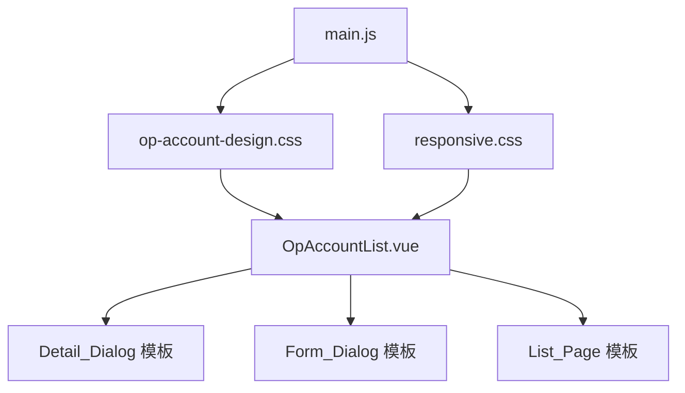

# 设计文档：运营账号 UI 重设计（op-account-ui-redesign）

## 概述

本设计文档描述对 TikTok Monitor 项目运营账号模块（`OpAccountList.vue`）的全面 UI 重设计方案。目标是在不引入新 UI 框架的前提下，通过 CSS 设计令牌系统和组件级样式覆盖，将现有 Element Plus 默认风格升级为 2025 大厂风格的精美界面。

设计语言参考：
- **Linear**：极简克制、精准间距、蓝紫强调色（`#5B6CF8`）
- **GitHub**：信息密度高但不拥挤、subtle 边框、功能性优先
- **Notion**：分组卡片、清晰的信息层次、柔和阴影

技术约束：Vue 3 + Element Plus + Vite，前端路径 `frontend/src/`，不引入新 UI 框架。

---

## 架构

### 整体改造策略

采用"设计令牌 + 局部覆盖"的分层架构：

```
frontend/src/
├── styles/
│   ├── responsive.css          # 现有响应式样式（保留）
│   └── op-account-design.css   # 新增：设计令牌 + 全局覆盖（新建）
└── views/
    └── OpAccountList.vue       # 主要改造目标（scoped 样式 + 模板重构）
```

**改造层次：**
1. **全局令牌层**（`op-account-design.css`）：定义 CSS 变量，覆盖 Element Plus 组件的默认变量
2. **组件模板层**（`OpAccountList.vue` `<template>`）：重构 HTML 结构，替换 `el-descriptions` 为自定义布局
3. **组件样式层**（`OpAccountList.vue` `<style scoped>`）：scoped 样式处理组件内部细节

### 依赖关系



---

## 组件与接口

### 1. 设计令牌文件（`op-account-design.css`）

独立 CSS 文件，在 `main.js` 中引入，定义全局 CSS 变量并覆盖 Element Plus 的 CSS 变量。

**引入方式（`main.js`）：**
```js
import './styles/op-account-design.css'
import './styles/responsive.css'
```

### 2. 自定义 Status Badge（内联实现）

不新建独立组件文件，在 `OpAccountList.vue` 内通过 CSS class 实现，避免引入额外文件依赖。

```html
<!-- 用法示例 -->
<span :class="['op-status-badge', `op-status-badge--${row.status}`]">
  {{ row.status }}
</span>
```

### 3. 详情弹窗 Hero 区域

替换现有的 `el-col` + `el-avatar` 布局，使用自定义 `.detail-hero` 容器：

```html
<div class="detail-hero">
  <el-avatar :src="row.avatar_url" :size="64" class="detail-hero__avatar">
    {{ (row.account||'?')[0].toUpperCase() }}
  </el-avatar>
  <div class="detail-hero__info">
    <h2 class="detail-hero__name">{{ row.account }}</h2>
    <p class="detail-hero__nickname">{{ row.nickname }}</p>
    <div class="detail-hero__badges">
      <span :class="['op-platform-badge', `op-platform-badge--${row.platform}`]">
        {{ row.platform?.toUpperCase() }}
      </span>
      <span :class="['op-status-badge', `op-status-badge--${row.status}`]">
        {{ row.status }}
      </span>
    </div>
  </div>
</div>
```

### 4. 分组卡片（Section Group）

替换 `el-descriptions` + `el-divider` 的组合，使用 `.section-group` 容器：

```html
<div class="section-group">
  <div class="section-group__title">账号凭证</div>
  <div class="section-group__body">
    <div class="info-row">
      <span class="info-row__label">密码</span>
      <span class="info-row__value">
        <span class="sensitive-value">{{ visible ? row.password : '••••••' }}</span>
        <el-icon class="eye-btn" @click="toggle"><View /></el-icon>
      </span>
    </div>
  </div>
</div>
```

---

## 数据模型

本次重设计为纯 UI 改造，不涉及后端数据模型变更。前端数据流保持不变：

```
API (op_accounts.js) → listOpAccounts() → accounts[] → OpAccountList.vue 渲染
```

**视图层新增的响应式状态：**

```js
// 详情弹窗敏感字段显示状态（已有，保持不变）
const visibleFields = ref({})  // { [rowId]: { password: bool, totp_secret: bool, ... } }

// 弹窗动画状态（新增，用于入场动画控制）
// 通过 CSS transition + el-dialog 的 open-delay 实现，无需额外 JS 状态
```

**Badge 映射配置（提取为常量，便于维护）：**

```js
const STATUS_CONFIG = {
  '正常': { class: 'op-status-badge--normal',  label: '正常' },
  '自用': { class: 'op-status-badge--self',    label: '自用' },
  '封禁': { class: 'op-status-badge--banned',  label: '封禁' },
  '已售': { class: 'op-status-badge--sold',    label: '已售' },
}

const PLATFORM_CONFIG = {
  tiktok:    { class: 'op-platform-badge--tiktok',    label: 'TikTok' },
  youtube:   { class: 'op-platform-badge--youtube',   label: 'YouTube' },
  instagram: { class: 'op-platform-badge--instagram', label: 'Instagram' },
  facebook:  { class: 'op-platform-badge--facebook',  label: 'Facebook' },
}
```

---

## 关键代码片段

### 设计令牌 CSS（`frontend/src/styles/op-account-design.css`）

```css
/* ===== Op Account UI 设计令牌 ===== */
:root {
  /* 颜色 */
  --color-bg-page:        #F7F8FA;
  --color-bg-card:        #FFFFFF;
  --color-bg-hover:       #F5F7FA;
  --color-border:         #E4E7ED;
  --color-border-subtle:  rgba(0, 0, 0, 0.06);
  --color-text-primary:   #1A1A2E;
  --color-text-secondary: #606266;
  --color-text-muted:     #909399;
  --color-accent:         #5B6CF8;
  --color-accent-light:   #EEF2FF;

  /* 间距 */
  --space-xs:  4px;
  --space-sm:  8px;
  --space-md:  16px;
  --space-lg:  24px;
  --space-xl:  32px;

  /* 圆角 */
  --radius-sm: 6px;
  --radius-md: 10px;
  --radius-lg: 14px;

  /* 阴影 */
  --shadow-card:   0 1px 3px rgba(0,0,0,0.08), 0 1px 2px rgba(0,0,0,0.04);
  --shadow-dialog: 0 20px 60px rgba(0,0,0,0.15);
}

/* ===== Element Plus 变量覆盖 ===== */
:root {
  --el-color-primary:        var(--color-accent);
  --el-border-color:         var(--color-border);
  --el-border-color-light:   var(--color-border-subtle);
  --el-fill-color-blank:     var(--color-bg-card);
  --el-bg-color:             var(--color-bg-card);
  --el-text-color-primary:   var(--color-text-primary);
  --el-text-color-regular:   var(--color-text-secondary);
  --el-text-color-secondary: var(--color-text-muted);
  --el-border-radius-base:   var(--radius-sm);
}

/* ===== 弹窗入场动画 ===== */
.el-dialog {
  border-radius: var(--radius-lg) !important;
  box-shadow: var(--shadow-dialog) !important;
  animation: dialog-enter 200ms cubic-bezier(0.16, 1, 0.3, 1) both;
}

@keyframes dialog-enter {
  from {
    opacity: 0;
    transform: scale(0.96);
  }
  to {
    opacity: 1;
    transform: scale(1);
  }
}

/* ===== 表格样式覆盖 ===== */
.el-table {
  --el-table-border-color: var(--color-border-subtle);
  --el-table-header-bg-color: #FAFBFC;
  --el-table-header-text-color: var(--color-text-secondary);
  --el-table-row-hover-bg-color: var(--color-bg-hover);
}

/* 去除列间竖线，保留行间分隔线 */
.el-table--border .el-table__cell {
  border-right: none !important;
}
.el-table .el-table__row td {
  border-bottom: 1px solid var(--color-border-subtle);
  transition: background-color 150ms ease;
}
.el-table th {
  font-size: 12px;
  font-weight: 500;
}

/* ===== 卡片样式覆盖 ===== */
.el-card {
  border-radius: var(--radius-md) !important;
  box-shadow: var(--shadow-card) !important;
  border: 1px solid var(--color-border) !important;
}

/* ===== Status Badge ===== */
.op-status-badge {
  display: inline-flex;
  align-items: center;
  padding: 2px 8px;
  border-radius: var(--radius-sm);
  font-size: 12px;
  font-weight: 500;
  line-height: 1.5;
  white-space: nowrap;
}
.op-status-badge--normal  { background: #DCFCE7; color: #166534; }
.op-status-badge--self    { background: #DBEAFE; color: #1E40AF; }
.op-status-badge--banned  { background: #FEE2E2; color: #991B1B; }
.op-status-badge--sold    { background: #F3F4F6; color: #6B7280; }

/* ===== Platform Badge ===== */
.op-platform-badge {
  display: inline-flex;
  align-items: center;
  padding: 2px 8px;
  border-radius: var(--radius-sm);
  font-size: 12px;
  font-weight: 500;
  line-height: 1.5;
  white-space: nowrap;
}
.op-platform-badge--tiktok    { background: #F0F0F0; color: #1A1A1A; }
.op-platform-badge--youtube   { background: #FEE2E2; color: #CC0000; }
.op-platform-badge--instagram { background: #FDF2F8; color: #9333EA; }
.op-platform-badge--facebook  { background: #EFF6FF; color: #1D4ED8; }

/* ===== 响应式：移动端弹窗 ===== */
@media (max-width: 768px) {
  .el-dialog {
    width: 95vw !important;
    max-height: 90vh !important;
    margin: 5vh auto !important;
  }
  .el-dialog__body {
    overflow-y: auto;
    max-height: calc(90vh - 120px);
  }
}
```

### 账号详情弹窗 HTML 结构

```html
<!-- 账号详情弹窗 -->
<el-dialog
  v-model="detailDialog.visible"
  width="680px"
  top="5vh"
  :show-close="true"
  class="op-detail-dialog"
>
  <template v-if="detailDialog.row">
    <!-- Hero 区域 -->
    <div class="detail-hero">
      <el-avatar
        :src="detailDialog.row.avatar_url"
        :size="64"
        class="detail-hero__avatar"
      >
        {{ (detailDialog.row.account||'?')[0].toUpperCase() }}
      </el-avatar>
      <div class="detail-hero__info">
        <h2 class="detail-hero__name">{{ detailDialog.row.account }}</h2>
        <p v-if="detailDialog.row.nickname" class="detail-hero__nickname">
          {{ detailDialog.row.nickname }}
        </p>
        <div class="detail-hero__badges">
          <span :class="['op-platform-badge', `op-platform-badge--${detailDialog.row.platform}`]">
            {{ detailDialog.row.platform?.toUpperCase() }}
          </span>
          <span :class="['op-status-badge', `op-status-badge--${statusKey(detailDialog.row.status)}`]">
            {{ detailDialog.row.status }}
          </span>
        </div>
      </div>
    </div>

    <!-- 数据概览 -->
    <div class="section-group">
      <div class="section-group__title">数据概览</div>
      <div class="stats-grid">
        <div class="stat-item">
          <div class="stat-item__value">{{ formatNum(detailDialog.row.follower_count) }}</div>
          <div class="stat-item__label">粉丝数</div>
        </div>
        <div class="stat-item">
          <div class="stat-item__value">{{ formatNum(detailDialog.row.following_count) }}</div>
          <div class="stat-item__label">关注数</div>
        </div>
        <div class="stat-item">
          <div class="stat-item__value">{{ formatNum(detailDialog.row.like_count) }}</div>
          <div class="stat-item__label">点赞数</div>
        </div>
        <div class="stat-item">
          <div class="stat-item__value">{{ formatNum(detailDialog.row.video_count) }}</div>
          <div class="stat-item__label">视频数</div>
        </div>
      </div>
    </div>

    <!-- 账号凭证 -->
    <div class="section-group">
      <div class="section-group__title">账号凭证</div>
      <div class="section-group__body">
        <div class="info-row" v-for="field in credentialFields" :key="field.key">
          <span class="info-row__label">{{ field.label }}</span>
          <span class="info-row__value">
            <template v-if="field.sensitive">
              <span class="sensitive-text">
                {{ visibleFields[detailDialog.row.id]?.[field.key]
                   ? detailDialog.row[field.key]
                   : (detailDialog.row[field.key] ? '••••••' : '—') }}
              </span>
              <el-icon
                v-if="detailDialog.row[field.key]"
                class="eye-btn"
                @click="toggleVisible(detailDialog.row.id, field.key)"
              >
                <View v-if="!visibleFields[detailDialog.row.id]?.[field.key]" />
                <Hide v-else />
              </el-icon>
            </template>
            <template v-else>
              {{ detailDialog.row[field.key] || '—' }}
            </template>
          </span>
        </div>
      </div>
    </div>

    <!-- TikTok 权限（条件显示） -->
    <div v-if="detailDialog.row.platform === 'tiktok'" class="section-group">
      <div class="section-group__title">TikTok 权限</div>
      <div class="tiktok-perms-grid">
        <div class="perm-item" v-for="perm in tiktokPerms" :key="perm.key">
          <span class="perm-item__icon" :class="detailDialog.row[perm.key] ? 'is-on' : 'is-off'">
            {{ detailDialog.row[perm.key] ? '✓' : '✗' }}
          </span>
          <span class="perm-item__label">{{ perm.label }}</span>
        </div>
      </div>
    </div>

    <!-- 采购 / 出售 -->
    <div class="section-group">
      <div class="section-group__title">采购 / 出售</div>
      <div class="section-group__body two-col">
        <div class="info-row"><span class="info-row__label">采购渠道</span><span class="info-row__value">{{ detailDialog.row.purchase_channel || '—' }}</span></div>
        <div class="info-row"><span class="info-row__label">采购金额</span><span class="info-row__value">{{ detailDialog.row.purchase_price != null ? '¥' + detailDialog.row.purchase_price : '—' }}</span></div>
        <div class="info-row"><span class="info-row__label">采购日期</span><span class="info-row__value">{{ detailDialog.row.purchase_date || '—' }}</span></div>
        <div class="info-row"><span class="info-row__label">出售客户</span><span class="info-row__value">{{ detailDialog.row.sale_customer || '—' }}</span></div>
        <div class="info-row"><span class="info-row__label">出售金额</span><span class="info-row__value">{{ detailDialog.row.sale_price != null ? '¥' + detailDialog.row.sale_price : '—' }}</span></div>
        <div class="info-row"><span class="info-row__label">出售日期</span><span class="info-row__value">{{ detailDialog.row.sale_date || '—' }}</span></div>
      </div>
    </div>

    <!-- 其他信息 -->
    <div class="section-group">
      <div class="section-group__title">其他信息</div>
      <div class="section-group__body">
        <div class="info-row"><span class="info-row__label">注册人</span><span class="info-row__value">{{ detailDialog.row.registrant || '—' }}</span></div>
        <div class="info-row"><span class="info-row__label">使用人</span><span class="info-row__value">{{ detailDialog.row.operator || '—' }}</span></div>
        <div class="info-row"><span class="info-row__label">账号来源</span><span class="info-row__value">{{ detailDialog.row.source || '—' }}</span></div>
        <div class="info-row"><span class="info-row__label">注册时间</span><span class="info-row__value">{{ detailDialog.row.account_created_at ? formatDate(detailDialog.row.account_created_at) : '—' }}</span></div>
        <div class="info-row"><span class="info-row__label">最后采集</span><span class="info-row__value">{{ detailDialog.row.last_collected_at ? formatDate(detailDialog.row.last_collected_at) : '—' }}</span></div>
        <div class="info-row info-row--full"><span class="info-row__label">备注</span><span class="info-row__value">{{ detailDialog.row.remark || '—' }}</span></div>
      </div>
    </div>
  </template>

  <template #footer>
    <el-button @click="detailDialog.visible = false">关闭</el-button>
    <el-button
      type="primary"
      @click="() => { detailDialog.visible = false; handleEdit(detailDialog.row) }"
    >编辑</el-button>
  </template>
</el-dialog>
```

### 详情弹窗 Scoped CSS

```css
/* Hero 区域 */
.detail-hero {
  display: flex;
  align-items: center;
  gap: var(--space-md);
  padding: 0 0 var(--space-lg);
  border-bottom: 1px solid var(--color-border-subtle);
  margin-bottom: var(--space-md);
}
.detail-hero__avatar {
  flex-shrink: 0;
  font-size: 24px;
}
.detail-hero__name {
  font-size: 18px;
  font-weight: 600;
  color: var(--color-text-primary);
  margin: 0 0 2px;
}
.detail-hero__nickname {
  font-size: 14px;
  color: var(--color-text-muted);
  margin: 0 0 var(--space-sm);
}
.detail-hero__badges {
  display: flex;
  gap: var(--space-xs);
}

/* 分组卡片 */
.section-group {
  margin-bottom: var(--space-md);
}
.section-group__title {
  font-size: 11px;
  font-weight: 600;
  color: var(--color-text-muted);
  text-transform: uppercase;
  letter-spacing: 0.6px;
  margin-bottom: var(--space-sm);
  padding-bottom: var(--space-xs);
  border-bottom: 1px solid var(--color-border-subtle);
}
.section-group__body {
  display: flex;
  flex-direction: column;
  gap: 2px;
}
.section-group__body.two-col {
  display: grid;
  grid-template-columns: 1fr 1fr;
  gap: 2px var(--space-md);
}

/* 信息行 */
.info-row {
  display: flex;
  align-items: center;
  min-height: 32px;
  padding: 4px 0;
}
.info-row--full {
  grid-column: 1 / -1;
}
.info-row__label {
  font-size: 13px;
  color: var(--color-text-muted);
  min-width: 90px;
  flex-shrink: 0;
}
.info-row__value {
  font-size: 13px;
  color: var(--color-text-primary);
  display: flex;
  align-items: center;
  gap: var(--space-xs);
  flex: 1;
}
.sensitive-text {
  font-family: 'SF Mono', 'Fira Code', monospace;
  letter-spacing: 1px;
}
.eye-btn {
  cursor: pointer;
  color: var(--color-text-muted);
  font-size: 14px;
  transition: color 150ms ease;
}
.eye-btn:hover { color: var(--color-accent); }

/* 数据概览网格 */
.stats-grid {
  display: grid;
  grid-template-columns: repeat(4, 1fr);
  gap: var(--space-sm);
  padding: var(--space-sm) 0;
}
.stat-item {
  text-align: center;
  padding: var(--space-sm);
  background: var(--color-bg-page);
  border-radius: var(--radius-sm);
}
.stat-item__value {
  font-size: 20px;
  font-weight: 700;
  color: var(--color-text-primary);
  line-height: 1.2;
}
.stat-item__label {
  font-size: 12px;
  color: var(--color-text-muted);
  margin-top: 2px;
}

/* TikTok 权限网格 */
.tiktok-perms-grid {
  display: grid;
  grid-template-columns: repeat(4, 1fr);
  gap: var(--space-sm);
}
.perm-item {
  display: flex;
  align-items: center;
  gap: var(--space-xs);
  padding: var(--space-xs) var(--space-sm);
}
.perm-item__icon {
  font-size: 14px;
  font-weight: 700;
  width: 20px;
  text-align: center;
}
.perm-item__icon.is-on  { color: #166534; }
.perm-item__icon.is-off { color: #9CA3AF; }
.perm-item__label {
  font-size: 13px;
  color: var(--color-text-secondary);
}
```

### 表单弹窗分组标题替换 `el-divider`

```html
<!-- 替换 <el-divider content-position="left">基础信息</el-divider> -->
<div class="form-section-title">基础信息</div>

<!-- TikTok 权限 2×2 网格 -->
<template v-if="form.platform === 'tiktok'">
  <div class="form-section-title">TikTok 权限</div>
  <div class="tiktok-switch-grid">
    <el-form-item label="中视频">
      <el-switch v-model="form.tiktok_mid_video" />
    </el-form-item>
    <el-form-item label="橱窗">
      <el-switch v-model="form.tiktok_showcase" />
    </el-form-item>
    <el-form-item label="手机直播">
      <el-switch v-model="form.tiktok_phone_live" />
    </el-form-item>
    <el-form-item label="伴侣直播">
      <el-switch v-model="form.tiktok_partner_live" />
    </el-form-item>
  </div>
</template>
```

```css
/* 表单分组标题 */
.form-section-title {
  font-size: 11px;
  font-weight: 600;
  color: var(--color-text-muted);
  text-transform: uppercase;
  letter-spacing: 0.6px;
  padding: var(--space-md) 0 var(--space-sm);
  border-bottom: 1px solid var(--color-border-subtle);
  margin-bottom: var(--space-sm);
}

/* TikTok 权限 2×2 网格 */
.tiktok-switch-grid {
  display: grid;
  grid-template-columns: 1fr 1fr;
  gap: var(--space-xs) var(--space-md);
}
```

### 批量操作工具栏

```html
<div class="batch-toolbar-new" v-if="selectedIds.length > 0">
  <span class="batch-toolbar-new__count">已选 {{ selectedIds.length }} 项</span>
  <el-button size="small" type="primary" @click="showBatchStatusDialog = true">
    批量修改状态
  </el-button>
  <el-button size="small" @click="handleBatchCollect" :loading="collectLoading">
    采集
  </el-button>
  <el-button size="small" type="danger" @click="handleBatchDelete">
    批量删除
  </el-button>
</div>
```

```css
.batch-toolbar-new {
  display: flex;
  align-items: center;
  gap: var(--space-sm);
  margin-top: var(--space-sm);
  padding: var(--space-sm) var(--space-md);
  background: var(--color-accent-light);
  border-radius: var(--radius-sm);
}
.batch-toolbar-new__count {
  font-size: 13px;
  font-weight: 500;
  color: var(--color-accent);
  margin-right: var(--space-xs);
}
```

---

## 正确性属性


*属性（Property）是在系统所有有效执行中都应成立的特征或行为——本质上是对系统应该做什么的形式化陈述。属性是人类可读规范与机器可验证正确性保证之间的桥梁。*

本功能以 UI 重设计为主，大多数验收标准属于 CSS 配置检查（SMOKE）或具体示例验证（EXAMPLE）。以下属性针对少数包含逻辑映射和状态管理的验收标准，这些标准的行为随输入变化，适合属性测试。

### 属性 1：Badge class 映射正确性

*对于任意* 有效的账号状态值（正常/自用/封禁/已售）或平台值（tiktok/youtube/instagram/facebook），渲染的 Badge 元素应包含与该值对应的唯一 CSS class，且不同值对应不同 class（映射无冲突）。

**验证：需求 4.2、4.4**

### 属性 2：敏感字段显示切换 Round-Trip

*对于任意* 包含非空敏感字段（password、totp_secret、email_password）的账号，初始渲染时该字段应显示遮蔽符号（`••••••`）而非真实值；点击眼睛图标两次后，显示状态应与初始状态完全相同（round-trip 恢复）。

**验证：需求 5.5、5.6**

### 属性 3：formatNum 格式化一致性

*对于任意* 非负整数 n，`formatNum(n)` 应返回包含千分位分隔符的字符串，且 `formatNum(null)` 和 `formatNum(undefined)` 应返回破折号占位符（`'—'` 或 `'-'`）；对于任意 n ≥ 1000，格式化结果的字符长度应大于 `String(n).length`（即确实插入了分隔符）。

**验证：需求 5.8**

### 属性 4：平台条件渲染正确性

*对于任意* 非 tiktok 的平台值（youtube/instagram/facebook），表单弹窗中 TikTok 权限区域应不可见；对于 tiktok 平台值，该区域应可见。即平台值与 TikTok 权限区域可见性之间存在严格的双向对应关系。

**验证：需求 6.7**

---

## 错误处理

### CSS 变量降级

所有 CSS 变量均提供内联降级值，确保在不支持 CSS 变量的旧浏览器中不会出现空白样式：

```css
/* 示例：带降级值的用法 */
.op-status-badge {
  border-radius: var(--radius-sm, 6px);
  font-size: 12px; /* 直接值作为降级 */
}
```

### 头像加载失败

`el-avatar` 的 `#error` 插槽已在现有代码中处理，重设计保留此逻辑：

```html
<el-avatar :src="row.avatar_url" :size="64">
  <!-- 加载失败时显示首字母 -->
  {{ (row.account||'?')[0].toUpperCase() }}
</el-avatar>
```

### 弹窗内容为空

详情弹窗使用 `v-if="detailDialog.row"` 守卫，防止 `detailDialog.row` 为 null 时访问属性导致报错（现有逻辑，保留）。

### 敏感字段为空

敏感字段的眼睛图标使用 `v-if="row[field.key]"` 条件渲染，字段为空时不显示切换按钮，避免无意义的交互。

### 移动端弹窗溢出

移动端弹窗设置 `max-height: 90vh` 和 `overflow-y: auto`，防止内容过长时弹窗超出视口。

---

## 测试策略

### 测试方法概述

本功能为纯 UI 重设计，测试重点在于：
1. **视觉回归测试**：确保改造后的样式符合设计规范
2. **组件单元测试**：验证条件渲染逻辑和状态管理
3. **属性测试**：验证映射函数和状态切换的普遍正确性

### 单元测试（示例测试）

使用 Vitest + Vue Test Utils，针对以下具体场景：

**Badge 渲染测试：**
```js
// 测试 Status Badge 渲染
it('正常状态渲染绿色 Badge', () => {
  const wrapper = mount(OpAccountList)
  // 检查 op-status-badge--normal class 存在
})

// 测试 Platform Badge 渲染
it('TikTok 平台渲染正确 Badge', () => {
  // 检查 op-platform-badge--tiktok class 存在
})
```

**条件渲染测试：**
```js
// 批量工具栏显示/隐藏
it('selectedIds 为空时不显示批量工具栏', () => { ... })
it('selectedIds 非空时显示批量工具栏', () => { ... })

// TikTok 权限区域
it('非 TikTok 平台时隐藏 TikTok 权限区域', () => { ... })
it('TikTok 平台时显示 TikTok 权限区域', () => { ... })

// 表单验证
it('平台为空时提交被阻止', () => { ... })
it('账号为空时提交被阻止', () => { ... })
```

**敏感字段测试：**
```js
it('敏感字段初始状态显示遮蔽符号', () => { ... })
it('点击眼睛图标后显示真实值', () => { ... })
it('再次点击眼睛图标后恢复遮蔽', () => { ... })
```

### 属性测试（Property-Based Testing）

使用 **fast-check**（JavaScript 属性测试库），每个属性测试运行最少 100 次迭代。

**安装：**
```bash
npm install --save-dev fast-check
```

**属性 1：Badge class 映射正确性**
```js
// Feature: op-account-ui-redesign, Property 1: Badge class 映射正确性
import fc from 'fast-check'

test('Status Badge class 映射无冲突', () => {
  const statuses = ['正常', '自用', '封禁', '已售']
  fc.assert(
    fc.property(
      fc.constantFrom(...statuses),
      (status) => {
        const classMap = {
          '正常': 'op-status-badge--normal',
          '自用': 'op-status-badge--self',
          '封禁': 'op-status-badge--banned',
          '已售': 'op-status-badge--sold',
        }
        const expectedClass = classMap[status]
        // 验证映射存在且唯一
        const allClasses = Object.values(classMap)
        return expectedClass !== undefined &&
               allClasses.filter(c => c === expectedClass).length === 1
      }
    ),
    { numRuns: 100 }
  )
})

test('Platform Badge class 映射无冲突', () => {
  const platforms = ['tiktok', 'youtube', 'instagram', 'facebook']
  fc.assert(
    fc.property(
      fc.constantFrom(...platforms),
      (platform) => {
        const classMap = {
          tiktok:    'op-platform-badge--tiktok',
          youtube:   'op-platform-badge--youtube',
          instagram: 'op-platform-badge--instagram',
          facebook:  'op-platform-badge--facebook',
        }
        const expectedClass = classMap[platform]
        const allClasses = Object.values(classMap)
        return expectedClass !== undefined &&
               allClasses.filter(c => c === expectedClass).length === 1
      }
    ),
    { numRuns: 100 }
  )
})
```

**属性 2：敏感字段显示切换 Round-Trip**
```js
// Feature: op-account-ui-redesign, Property 2: 敏感字段显示切换 Round-Trip
test('敏感字段切换两次恢复初始状态', () => {
  fc.assert(
    fc.property(
      fc.record({
        id: fc.integer({ min: 1, max: 9999 }),
        password: fc.string({ minLength: 1 }),
      }),
      ({ id, password }) => {
        const visibleFields = {}
        // 初始状态：未显示
        const initial = visibleFields[id]?.password ?? false
        // 第一次切换
        if (!visibleFields[id]) visibleFields[id] = {}
        visibleFields[id].password = !visibleFields[id].password
        // 第二次切换
        visibleFields[id].password = !visibleFields[id].password
        // 应恢复初始状态
        return (visibleFields[id].password ?? false) === initial
      }
    ),
    { numRuns: 100 }
  )
})
```

**属性 3：formatNum 格式化一致性**
```js
// Feature: op-account-ui-redesign, Property 3: formatNum 格式化一致性
test('formatNum 对任意非负整数插入千分位分隔符', () => {
  fc.assert(
    fc.property(
      fc.integer({ min: 1000, max: 999999999 }),
      (n) => {
        const result = formatNum(n)
        // 格式化后字符串长度应大于原始数字字符串长度（插入了分隔符）
        return result.length > String(n).length
      }
    ),
    { numRuns: 100 }
  )
})

test('formatNum 对 null/undefined 返回占位符', () => {
  fc.assert(
    fc.property(
      fc.constantFrom(null, undefined),
      (n) => {
        const result = formatNum(n)
        return result === '-' || result === '—'
      }
    ),
    { numRuns: 100 }
  )
})
```

**属性 4：平台条件渲染正确性**
```js
// Feature: op-account-ui-redesign, Property 4: 平台条件渲染正确性
test('非 TikTok 平台时 TikTok 权限区域不可见', () => {
  const nonTiktokPlatforms = ['youtube', 'instagram', 'facebook']
  fc.assert(
    fc.property(
      fc.constantFrom(...nonTiktokPlatforms),
      (platform) => {
        // 模拟 form.platform 的条件判断
        const shouldShow = platform === 'tiktok'
        return shouldShow === false
      }
    ),
    { numRuns: 100 }
  )
})

test('TikTok 平台时 TikTok 权限区域可见', () => {
  fc.assert(
    fc.property(
      fc.constant('tiktok'),
      (platform) => {
        const shouldShow = platform === 'tiktok'
        return shouldShow === true
      }
    ),
    { numRuns: 100 }
  )
})
```

### 视觉回归测试（可选）

如需验证像素级视觉一致性，可使用 Playwright + Percy 或 Chromatic 进行截图对比。本阶段不强制要求，建议在首次实现后建立基准截图。

### 测试配置

```js
// vitest.config.js 中确保测试覆盖 frontend/src/views/OpAccountList.vue
export default {
  test: {
    environment: 'jsdom',
    globals: true,
  }
}
```

每个属性测试标注格式：
```
// Feature: op-account-ui-redesign, Property {N}: {属性描述}
```
