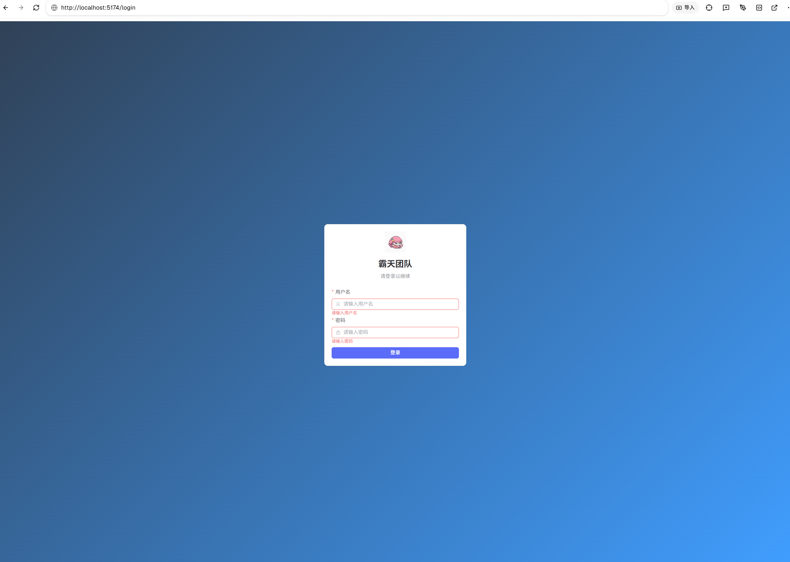
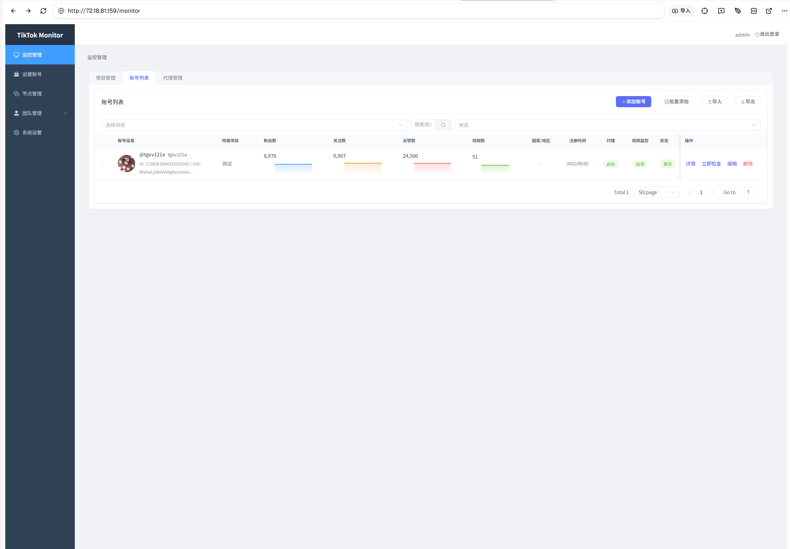
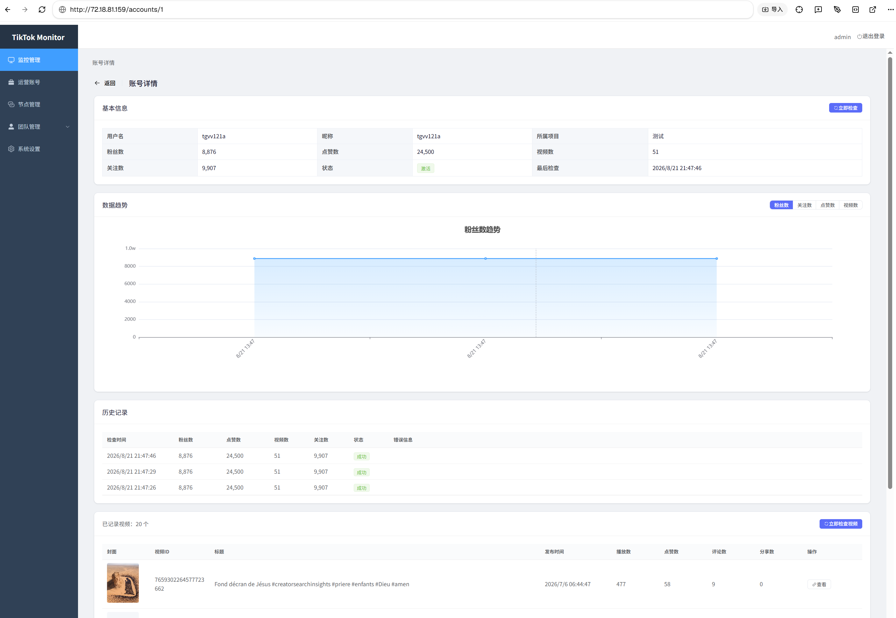
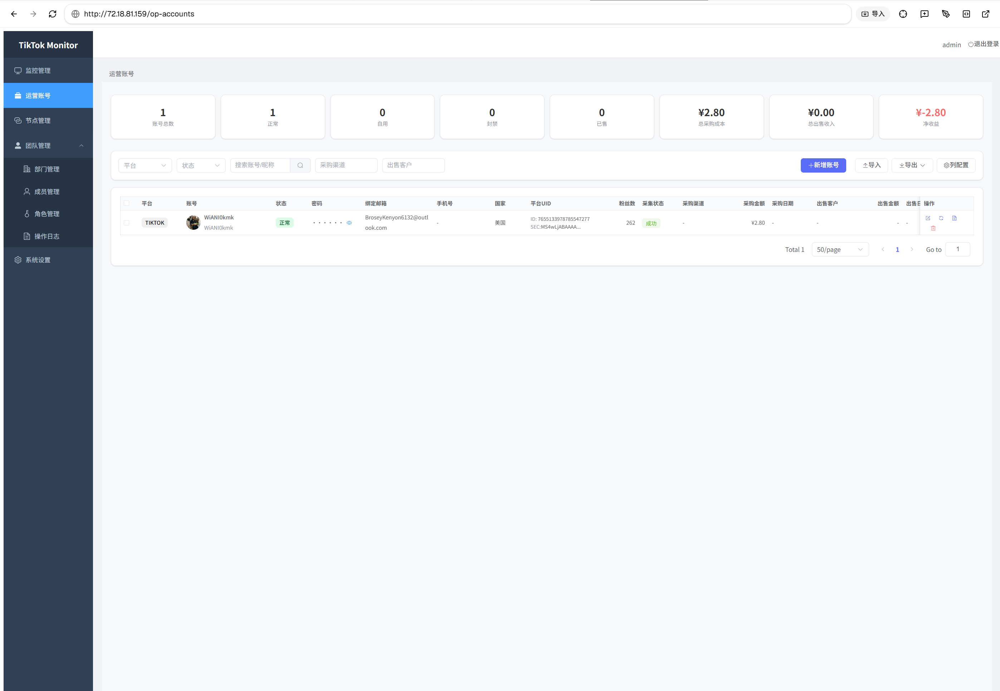

# TikTok Monitor

TikTok 账号监控与运营管理系统。

## 技术栈

- 后端：FastAPI、SQLAlchemy、APScheduler
- 前端：Vue 3、Element Plus、ECharts、Vite
- 数据库：SQLite（默认）

## 本地启动（Windows）

推荐 Python 3.12。

```bat
cd /d F:\编程相关软件\crm\tk_crm\backend
python -m venv .venv312
.\.venv312\Scripts\python.exe -m pip install -r requirements.txt
.\.venv312\Scripts\python.exe -m alembic upgrade head
.\.venv312\Scripts\python.exe run.py
```

另开终端启动前端：

```bat
cd /d F:\编程相关软件\crm\tk_crm\frontend
npm install
npm run dev -- --host 0.0.0.0 --port 5174
```

前端：<http://localhost:5174/>  
后端文档：<http://localhost:8001/docs>

## 默认账号

用户名 `admin`，密码 `admin123456`。首次登录后请修改密码。

## 配置

后端配置文件为 `backend/.env`，默认数据库：

```env
DATABASE_URL=sqlite:///./data/monitor.db
```

生产环境请修改 JWT 密钥、字段加密密钥和管理员密码，然后执行 `alembic upgrade head`。

## Docker 部署

```bash
docker compose up -d --build
```

## 功能

- TikTok、YouTube、Instagram、Facebook 运营账号管理
- 账号监控、趋势数据和视频采集
- HTTP/HTTPS/SOCKS5 代理节点
- 项目、部门、角色和成员权限
- CSV/Excel 导入导出
- 响应式移动端界面
- 同一平台禁止重复账号
- 运营账号可不绑定项目创建

## 界面预览

### 登录



### 监控账号列表



### 账号详情与数据趋势



### 运营账号管理



## 许可证

MIT License
